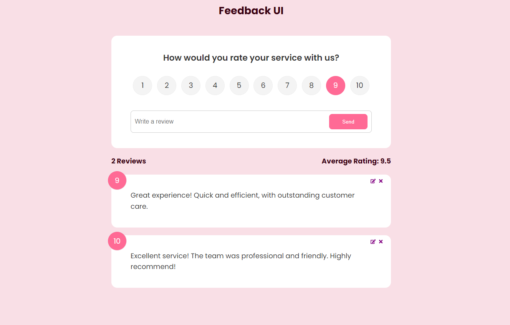

# Feedback

## Backend repository for Rythmix

**Frontend repository:**
https://github.com/liron28/Rythmix



 Feedback app is designed to simplify the process of gathering and sharing reviews about products and services. Users can effortlessly write and submit their feedback.


## How to use - Installation

To get started with the feedback project, follow these steps:

1. **Clone the repository**:

   ```bash
   git clone [https://github.com/liron28/Rythmix.git](https://github.com/liron28/feedback-app.git)
   ```

2. **Install dependencies**:

   Make sure you have [Node.js](https://nodejs.org/) installed. Then run:

   ```bash
   npm install
   ```

## Usage

To start the development server, use the following command:

```bash
npm run dev
```

## Technologies Used

- **Frontend**: React
- **Backend**: Node.js


